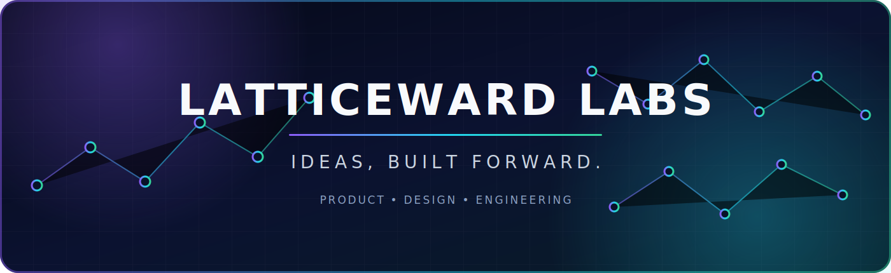

<div align="center">



<br />


### We turn ambitious ideas into focused, useful, and scalable digital products.

**Latticeward** is where connected thinking becomes forward motion.  
We combine product strategy, human-centered design, and disciplined engineering to build products people can trust.

</div>

---

## ◈ Our Build Constellation

<table>
<tr>
<td width="33%" valign="top">

### ◉ Product

Clear problems before clever solutions.

- Product vision
- PRD and MVP definition
- User research
- Roadmaps and metrics
- Evidence-led decisions

</td>
<td width="33%" valign="top">

### ◇ Design

Interfaces built around real human context.

- UX strategy
- Interaction design
- Design systems
- Accessibility
- Prototyping and testing

</td>
<td width="33%" valign="top">

### ⬡ Engineering

Reliable foundations that can grow.

- Mobile and web systems
- Clean architecture
- Quality automation
- Performance
- Secure delivery

</td>
</tr>
</table>

---

## 🎧 Flagship Project — Music Copilot

> A voice-assisted Android music experience designed to reduce distracting interactions while driving.

Music Copilot begins with a deliberately focused promise: make essential music playback easier to control with fewer taps, clear feedback, and reliable Android behavior.

<table>
<tr>
<td width="50%" valign="top">

### MVP — What We Are Building

- Native Android application
- Local music library and search
- Stable background playback
- Lock-screen and notification controls
- Bluetooth-friendly behavior
- Low-distraction Driving Mode
- Push-to-Talk voice control
- Six direct voice commands
- Local settings and history
- Privacy-first diagnostics

</td>
<td width="50%" valign="top">

### Later — After Validation

- Authorized music-service integrations
- Accounts and cloud synchronization
- iOS
- Wake-word interaction
- Conversational AI
- Advanced recommendations
- Full Android Auto exploration
- Artist and content tools
- Licensed streaming architecture
- Subscription systems

</td>
</tr>
</table>

<div align="center">

[](./docs/MUSIC_COPILOT_SKILLS.md)

</div>

---

## ⚡ Capability Stack

### Product Intelligence


### Android Core


### Audio Platform


### Voice and Applied AI


### Experience Design


### Quality, Delivery, and Learning


### Security, Rights, and Future Platform


---

## 🧭 Delivery Vector

| Stage | Mission | Proof |
| :---: | --- | --- |
| **01** | Product foundation | Approved PRD, MVP boundary, metrics, architecture |
| **02** | Reliable local player | Library, queue, background, lock screen, Bluetooth |
| **03** | Voice + Driving Mode | Six commands, clear feedback, low-distraction UX |
| **04** | Closed beta | 50 drivers, crash data, command accuracy, interviews |
| **05** | Version 1.1 | Reliability, matching, playlists, accessibility |
| **06** | Legal integrations | Authorized APIs/SDKs, OAuth, rights and policy review |

---

## ◎ The Skills Behind the System

Building Music Copilot is not only an Android task. It requires the team to understand the full system:

<details>
<summary><b>Product and research</b></summary>
<br />

Vision, PRD writing, MVP boundaries, user interviews, jobs-to-be-done, metrics, analytics, experiments, roadmap design, backlog management, and beta learning.

</details>

<details>
<summary><b>Android, audio, and local data</b></summary>
<br />

Kotlin, Compose, lifecycle, modular architecture, Media3, ExoPlayer, MediaSession, Audio Focus, Bluetooth, foreground services, MediaStore, Room, DataStore, search, queue persistence, and recovery.

</details>

<details>
<summary><b>Voice, AI, and language interaction</b></summary>
<br />

Speech recognition, constrained intent parsing, entity normalization, fuzzy matching, confidence thresholds, TTS, road-noise testing, multilingual design, latency measurement, and privacy.

</details>

<details>
<summary><b>Design and accessibility</b></summary>
<br />

Driver-centered UX, Figma, design systems, large touch targets, glanceable feedback, dark mode, contrast, TalkBack, localization, RTL, usability testing, and design handoff.

</details>

<details>
<summary><b>Quality and release engineering</b></summary>
<br />

Unit, integration, UI and device testing; Bluetooth and interruption scenarios; GitHub Actions; static analysis; app signing; Play Internal Testing; Crashlytics; performance, battery, and release management.

</details>

<details>
<summary><b>Security, privacy, and music law</b></summary>
<br />

Least privilege, secure local storage, permission design, data minimization, GDPR-aware thinking, Google Play policies, copyright, music rights, licenses, API terms, and regional restrictions.

</details>

<details>
<summary><b>Future platform capabilities</b></summary>
<br />

Backend architecture, identity, OAuth, APIs, PostgreSQL, queues, caching, observability, payments, music-service integrations, recommendations, content administration, licensing systems, and streaming fundamentals.

</details>

---

## ⬡ How We Work

```text
DISCOVER  →  DEFINE  →  DESIGN  →  BUILD  →  VERIFY  →  LEARN  →  EVOLVE
```

- We reduce uncertainty before increasing scope.
- We build the smallest trustworthy version.
- We treat accessibility, privacy, and reliability as product features.
- We review decisions as carefully as code.
- We expand only when evidence and legal permission support the next step.
- We document what matters so the whole team can move forward.

---

<div align="center">

### LATTICEWARD LABS

**Connected thinking. Focused execution. Products built forward.**

<sub>Product · Design · Engineering · Quality · Learning</sub>

</div>
