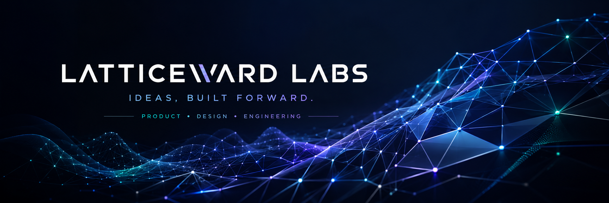

<div align="center">



<br />


### We turn ambitious ideas into focused, useful, and scalable digital products.

**Latticeward Labs** is an independent, early-stage product team working across strategy, design, engineering, and quality. We turn carefully defined problems into trustworthy software—starting small, validating with real users, and expanding with evidence.

</div>

---

## ◈ What We Do

<table>
<tr>
<td width="33%" valign="top">

### ◉ Product

We clarify the problem before committing to the solution.

- Product strategy
- PRD and MVP definition
- User research
- Roadmaps and metrics
- Evidence-led decisions

</td>
<td width="33%" valign="top">

### ◇ Design

We design clear, accessible experiences around real human contexts.

- UX strategy
- Interaction design
- Design systems
- Accessibility
- Prototyping and testing

</td>
<td width="33%" valign="top">

### ⬡ Engineering

We build reliable foundations that can evolve with the product.

- Mobile and web development
- Maintainable architecture
- Quality automation
- Performance and security
- Measured delivery

</td>
</tr>
</table>

---

## 🚀 Projects

| Project | What it is | Status |
| --- | --- | :---: |
| **Music Copilot** | A voice-assisted Android music experience designed to reduce distracting interactions while driving. Its first MVP focuses on local music playback, a low-distraction Driving Mode, and direct Push-to-Talk voice controls. | **In active development** |

Music Copilot is our current flagship project. The product is still being built and validated; items described as future work are not presented as released capabilities. Detailed product requirements, technical decisions, delivery plans, and testing criteria are maintained in the project repository rather than on this team profile.

Future products will appear here as they move from exploration into active development.

---

## ⚡ Capabilities We Use and Develop

Our capability map represents the disciplines we actively use, study, and strengthen while building products. It is a direction of growth—not a claim that every capability is already mature or owned by every contributor.

### Product and Research


### Design and Experience


### Engineering and Delivery


---

## 🧭 How We Work

```text
DISCOVER  →  DEFINE  →  DESIGN  →  BUILD  →  VERIFY  →  LEARN  →  EVOLVE
```

- We reduce uncertainty before increasing scope.
- We build the smallest version that can earn trust.
- We treat accessibility, privacy, reliability, and legal constraints as product requirements.
- We document decisions so product, design, and engineering stay aligned.
- We expand only when user evidence and technical readiness support the next step.

---

## ◎ Team Status

Latticeward Labs is currently an independent, remote-first team in the product-building and validation stage. Our immediate focus is delivering the approved first MVP of Music Copilot while developing a repeatable way to take future ideas from research to reliable release.

Project-specific progress is tracked in its own repository and development board. This profile remains the home for the identity, principles, capabilities, and growing portfolio of the wider team.

---

<div align="center">

### LATTICEWARD LABS

**Connected thinking. Focused execution. Products built forward.**

<sub>Product · Design · Engineering · Quality · Learning</sub>

</div>
